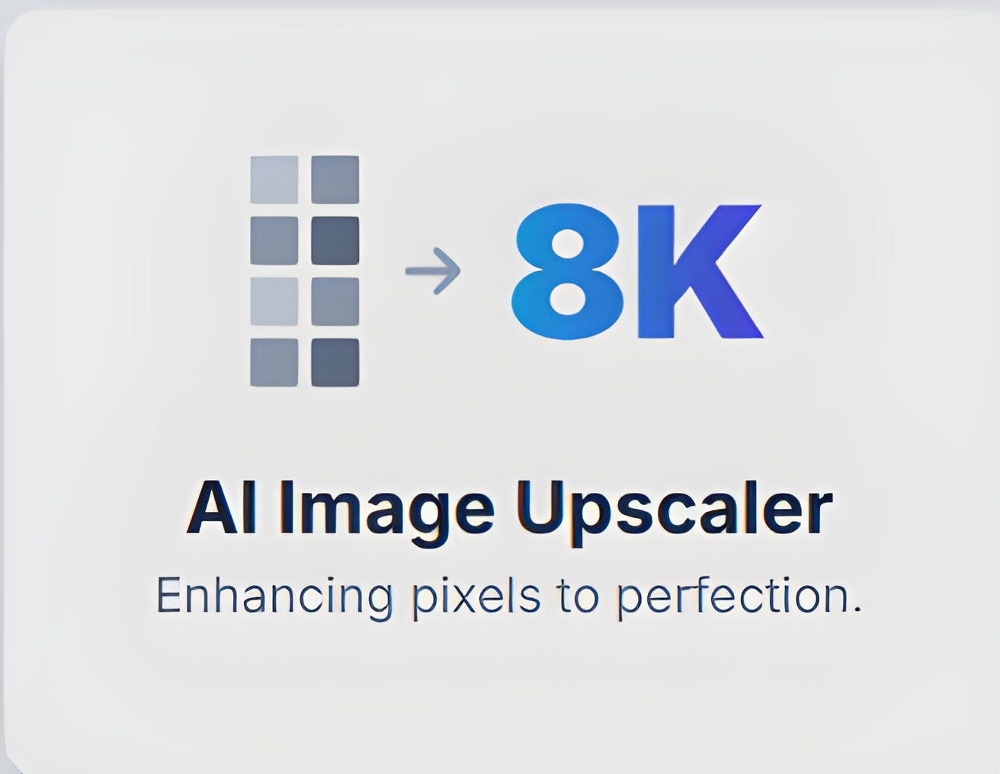
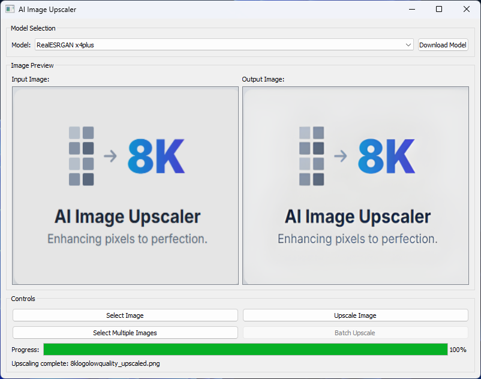

<h1 align="center">FreeAiImageUpscaler8k</h1>

<strong>Enhance your images to 8K quality with state-of-the-art AI models</strong>
  

Showcase
Here is a look at the user-friendly interface and the powerful results you can achieve.

<em>Application GUI</em> 

<em>(Placeholder for Before & After Comparison)</em> 

🌟 Features
High-Quality Upscaling: Enhance images up to 4x their original resolution.

Multiple AI Models: Choose from different models optimized for photos or anime/illustrations.

User-Friendly Interface: Simple and intuitive GUI for easy operation.

Batch Processing: Upscale multiple images at once.

Preview Functionality: Compare original and upscaled images.

Automatic Model Management: Models are downloaded automatically when needed.

GPU Acceleration: Utilizes CUDA for faster processing (with CPU fallback).

Tiling Support: Efficiently processes large images by breaking them into manageable tiles.

📋 Requirements
Python 3.7+

CUDA-compatible GPU (recommended for faster processing)

Dependencies: PyTorch, OpenCV, PyQt5, etc. (see requirements.txt)

🚀 Installation
Option 1: Clone the Repository

# Clone the repository
git clone [https://github.com/RorriMaesu/FreeAiImageUpscaler8k.git](https://github.com/RorriMaesu/FreeAiImageUpscaler8k.git)
cd FreeAiImageUpscaler8k

# Create a virtual environment (optional but recommended)
python -m venv venv

# On Windows
venv\Scripts\activate
# On macOS/Linux
source venv/bin/activate

# Install dependencies
pip install -r requirements.txt

# Run setup script
python setup.py

Option 2: Download the Release

Go to the Releases page.

Download the latest release for your platform.

Extract the archive and run the application.

🖥️ Usage
Running the Application

# Option 1: Using the Python launcher script
python main.py

# Option 2: Using the batch file (Windows)
run_upscaler.bat

# Option 3: Running the main module directly
python imageUpscaler/main.py

Using the GUI

Select a Model: Choose an AI model from the dropdown menu (e.g., RealESRGAN x4plus, SwinIR Large).

Single Image Upscaling:

Click "Select Image" to choose an image file.

Click "Upscale Image" to process the image.

The upscaled image will be displayed in the preview area and saved to the output directory.

Batch Processing:

Click "Select Multiple Images" to choose multiple image files.

Click "Batch Upscale" to process all selected images.

Upscaled images will be saved to the output directory.

🧠 AI Models
The application uses state-of-the-art AI models for image upscaling:

RealESRGAN: Enhanced version of ESRGAN with improved training methodology and real-world degradation modeling.

SwinIR: Transformer-based model that achieves excellent results for image restoration tasks.

Models are automatically downloaded when first used and stored in the models directory.

🔧 Technical Details
The application is built with a modular architecture for maintainability and robustness, featuring centralized logging, custom error handling, and a clear separation between UI and core logic.

Project Structure
FreeAiImageUpscaler8k/
├── assets/
├── imageUpscaler/
│   ├── models/
│   ├── ui/
│   ├── utils/
│   ├── main.py
│   └── setup.py
├── main.py
├── run_upscaler.bat
├── LICENSE
└── README.md

Error Handling and Logging
Centralized Logging: All components use a centralized logging system.

Custom Exception Hierarchy: Custom exception types for different error categories.

Graceful Degradation: The application attempts to continue operation when possible.

👥 Contributing
Contributions are welcome! Please follow these guidelines:

Fork the repository.

Create a feature branch (git checkout -b feature/amazing-feature).

Make your changes and commit them (git commit -m 'Add some amazing feature').

Push to the branch (git push origin feature/amazing-feature).

Open a Pull Request.

Please follow the existing code style, add unit tests for new features, and update documentation as needed.

📝 License
This project is licensed under the MIT License - see the LICENSE file for details.

🙏 Support the Project
If you find this tool useful, consider supporting its development. Your support helps maintain and improve this free tool for everyone!
 

🔗 Acknowledgments

Real-ESRGAN by Xintao Wang et al.

SwinIR by Jingyun Liang et al.

BasicSR framework for Super-Resolution

